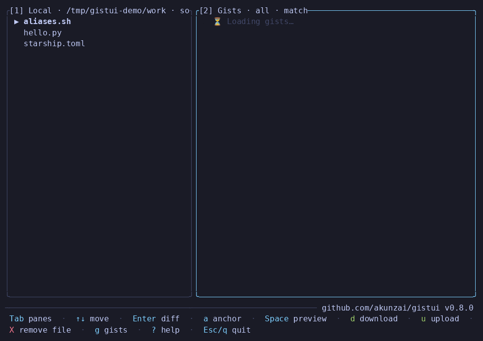

# gistui

A terminal UI for managing GitHub Gists. Browse, diff, download, upload, create, edit, and
pin your gists — and pair them with files in your working directory — all through the
GitHub CLI (`gh`).



## Requirements

- The GitHub CLI: [`gh`](https://cli.github.com), installed and on your `PATH`
- An authenticated `gh` session: `gh auth login`
- A Rust toolchain — **only if building from source** — <https://rustup.rs>

`gistui` shells out to `gh` at runtime (it stores no GitHub token of its own), so `gh` must
be installed and authenticated wherever you run `gistui`.

## Installation

### Download a prebuilt binary (recommended)

Each [release](https://github.com/akunzai/gistui/releases/latest) attaches prebuilt,
checksummed binaries — no Rust toolchain required.

The install script detects your platform, downloads the matching release asset, verifies
its SHA-256 checksum, and installs it into `~/.local/bin`:

```bash
curl -fsSL https://raw.githubusercontent.com/akunzai/gistui/main/install.sh | bash
```

It supports Linux (x86-64/ARM64), macOS (Intel/Apple Silicon), and Windows (x86-64) under
[Git Bash](https://gitforwindows.org)/MSYS2. Pass `--version <tag>` to pin a release or
`--bin-dir <dir>` to change the install location.

Prefer to install by hand? Grab the archive for your platform from the releases page:

| Platform | Asset |
|----------|-------|
| macOS (Apple Silicon) | `gistui-<version>-aarch64-apple-darwin.tar.gz` |
| macOS (Intel) | `gistui-<version>-x86_64-apple-darwin.tar.gz` |
| Linux (x86-64) | `gistui-<version>-x86_64-unknown-linux-gnu.tar.gz` |
| Linux (ARM64) | `gistui-<version>-aarch64-unknown-linux-gnu.tar.gz` |
| Windows (x86-64) | `gistui-<version>-x86_64-pc-windows-msvc.zip` |

Then extract it and put `gistui` somewhere on your `PATH`, e.g. on macOS/Linux:

```bash
tar -xzf gistui-<version>-<target>.tar.gz
install -m 755 gistui-<version>-<target>/gistui ~/.local/bin/gistui
```

### Build from source

With a Rust toolchain, install into `~/.cargo/bin` (make sure that directory is on your
`PATH`):

```bash
cargo install --path .
```

Or build a release binary and place it yourself:

```bash
cargo build --release
# binary is at target/release/gistui — copy or symlink it onto your PATH, e.g.
ln -sf "$PWD/target/release/gistui" ~/.local/bin/gistui
```

## Usage

```bash
gistui            # launch the TUI in the current directory (needs a TTY)
gistui ~/dotfiles # launch against a specific working directory
gistui --check    # print gh readiness, then exit (no TUI)
```

Run `gistui` from the directory whose files you want to pair with your gists, or pass that
directory as an argument. The path defaults to the current directory; if you pass one that
does not exist (or is not a directory) `gistui` prints an error and exits without launching.
Inside the TUI press `?` for the full keymap (it also shows the running version and the
project repository link); the footer shows the keys relevant to the focused pane.

The left pane lists the files in your current working directory; the right pane lists your
gists. Ranking is **anchor-driven**: one pane is the *anchor* (it drives the ranking) and
the other pane is ranked against the anchor's current selection. The anchor is shown with a
`⚓` marker in its title and is **independent of focus** — press `a` to flip it. So you
can keep the Local pane driving (gists ranked against the selected file), `Tab` over to the
gist pane to pick a candidate, and the order won't reset; press `a` to drive from the gist
side instead. Ranked rows are flagged with `📌` (an existing pinned pair) or **bold** (a
same-filename candidate). Browse with `Tab` (switch pane) or `1`/`2` (jump to the Local /
Gist pane), `Up`/`Down` (move), and `Left`/`Right` (scroll a long row).

### Actions

- `Enter` (on a gist) — preview the unified diff between the selected local file and the
  gist, with `+`/`-` colour and **word-level inline highlighting** of changed words. The
  diff direction follows the **focused pane**: focus the Gists pane for a *download* view
  (`--- local` / `+++ gist`), or the Local pane for an *upload* view (`--- gist` /
  `+++ local`). The `---`/`+++` header labels are tinted so each side stays identifiable
  regardless of direction — **local in yellow, gist in blue**. From there `d` downloads or
  `u` uploads, and `c` toggles between showing a few context lines around each change (the
  `diff_context` config, default 3) and the full file. The choice is remembered (persisted
  to config).
- `d` (on a gist) — download it into the cwd as `./<gist-filename>`. A brand-new file is
  written directly; an existing one is shown as a diff and overwritten only after a `y`/`n`
  confirmation.
- `u` (on a gist) — upload the selected local file into the gist under the local file's
  name (shows a confirmation screen with unified diff). From there:
  - `y` / `n` / `Esc` — confirm and upload / cancel.
  - `e` — edit / redact the upload content in `$EDITOR` before upload (does NOT mutate the local file).
  - `p` / `s` — (JSON only) toggle pretty-print / recursive key sorting on the upload buffer.
- `n` (on a local file) — create a new gist from it: type an optional description, then
  choose `s` secret or `p` public.
- `X` (on a gist) — remove the selected file from its gist after a `y`/`n` confirmation.
  Deleting a whole gist lives in the **gist manager** (`g`); a gist's only file can't be
  removed (delete the gist instead).
- `g` — open the **gist manager** (gist-level view): edit descriptions, delete gists, and
  more (see below).
- `p` (on a gist) — toggle a pin between the selected local file and gist (persisted to
  config; pinned pairs sort to the top).
- `P` — open the **Pins view** listing all pinned pairs with sync-status icons.
  Each row shows one of: `✓` synced · `↑` local newer · `↓` remote newer · `?` unknown,
  plus `(local <age> · gist <age>)` relative modification times.
  Keys inside the Pins view:
  - `Enter` — diff the selected pair (read-only; `d`/`u` from the diff to pull/push; `Esc`/`q` returns to the Pins view).
  - `s` — smart-sync (newer side wins by modified time; skips if already identical).
  - `u` — force push (upload local → gist).
  - `d` — force pull (download gist → local, diff + `y`/`n` confirm).
  - `x` — unpin the selected pair.
- `S` (on a pinned pair) — smart-sync the selected local↔gist pair from the list screen
  (push/pull by modified time; only available when the pair is pinned).
- `e` (on a local file) — open it in `$VISUAL`/`$EDITOR`.
- `Space` (on a gist) — preview the gist's raw content in a scrollable overlay (`R` to
  force-refresh, bypassing the session cache).
- `r` — toggle **recursive** local file discovery; the pane title shows `[↓]` while active
  and scans in the background so the UI stays responsive.
- `a` — flip the **anchor** (which pane drives match ranking); independent of focus, so you
  can focus the ranked pane to pick a file without the order resetting.
- `/` filter by text · `v` cycle visibility (all/public/secret) · `s` cycle the **focused
  pane's** sort (match / name / recent — gists by name/updated, local files by
  name/modified-time) · `t` toggle row view.
- `Esc`/`q` — go back from an overlay; on the main list, press twice to quit (the first press
  arms the quit, any other key cancels) so a stray key never exits the app.
- `?` — show the help overlay.

When no local file is selected (e.g. an empty directory), the right pane lists all gists
unranked so you can still preview and download into the current directory.

### Gist manager (`g`)

Press `g` to open the **gist manager** — a gist-level view (one row per gist) that lands on
the gist owning the currently selected file. From here you manage gists as a whole:

- `e` — edit the gist's description (type, `Enter` applies, `Esc` cancels).
- `Enter` — open the **gist detail view**: shows basic info (description, visibility,
  created/updated age, file count, short id), the file list, and fetched comments.
  - `↑`/`↓` scroll comments · `PageUp`/`PageDown` page through comments.
  - `c` compact · `o` browser · `q`/`Esc` back to the gist manager.
- `X` — delete the entire gist and all its files, after a `y`/`n` confirmation.
- `o` — open the gist on gist.github.com in your browser.
- `c` — compact revisions: after showing the revision count and a `y`/`n` confirmation, the
  gist is cloned to a temp dir, its history squashed to a single commit, and force-pushed —
  collapsing all older revisions. Irreversible. (When triggered from the detail view, the
  confirmation prompt shows the gist's info as context.)
- `s` cycle sort (updated / created) · `v` cycle visibility (all/public/secret) · `/` filter
  by description or id · `Left`/`Right` scroll a long description.
- `q`/`Esc` — back to the list.

## Safety rules

- Downloads only ever write to `./<gist-filename>` in the current working directory.
- An existing file (local download target or remote gist file) is never overwritten without
  first showing its diff and confirmation. Confirmations appear as a centered prompt over
  the full-screen diff, so the change you are approving stays visible while you decide.
- Uploads allow editing/redacting a temporary buffer in `$EDITOR` before sending, ensuring sensitive local content or credentials are not accidentally pushed to GitHub.
- Identical files are detected: when the two sides match, upload/download are disabled.
- Pulling a gist over an existing local file still goes through the diff + `y`/`n`
  confirmation — one-key sync never overwrites a local file silently.
- Destructive remote actions each require a `y`/`n` confirmation: removing a file from a
  gist (`X` on the list), deleting a whole gist (`X` in the gist manager), and compacting a
  gist's revisions (`c` in the gist manager or detail view — a history-rewriting force-push;
  the confirmation prompt displays the gist's info so the target stays visible while you decide).
- No GitHub token is stored by the app, and gist content is never written to the config
  file — only path↔gist pin mappings are persisted.

## Configuration

The config file lives at `~/.config/gistui/config.toml` (or
`$XDG_CONFIG_HOME/gistui/config.toml` if that variable is set). It is created
automatically the first time you pin a file. All fields are optional.

| Field | Type | Description |
|-------|------|-------------|
| `scan_depth` | `integer` | Maximum directory depth for recursive discovery (`r` key). Default `2`. |
| `skip_dirs` | `[string]` | Directory names skipped during recursive discovery (`r` key). Defaults to common build/dependency dirs (`node_modules`, `target`, …). Hidden dirs (`.`-prefix) are always skipped. |
| `[[pinned]]` | table array | Local-file ↔ gist mappings managed by the `p`/`P` keys. Can also be edited by hand. |

Copy [`config.example.toml`](config.example.toml) from the repo for an annotated
starting point:

```bash
mkdir -p ~/.config/gistui
cp config.example.toml ~/.config/gistui/config.toml
```

## Building a release

```bash
cargo build --release
```

The optimized binary is `target/release/gistui`. It bundles no assets, but still requires
the `gh` CLI on `PATH` at runtime (`gh` is not vendored). Optionally shrink it with
`strip target/release/gistui`.

## Development

All four checks must pass before committing (clippy warnings are treated as errors):

```bash
cargo fmt --check
cargo test
cargo check
cargo clippy --all-targets -- -D warnings
```
